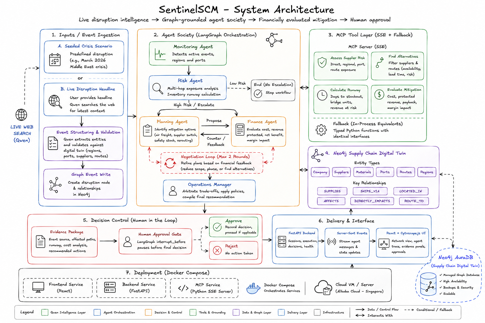

# SentinelSCM — Multi-Agent Supply Chain Control Tower

**Live demo:** http://47.82.152.175:3000
**Track:** Global AI Hackathon Series with Qwen Cloud — Track 3: Agent Society

Five LangGraph agents monitor, assess, plan, and finance a response to supply chain disruptions — from a seeded 2026 Middle East crisis or from a live disruption headline — with a full evidence chain and human approval before anything is recommended.

---

## The blind spot this closes

McKinsey's 2024 Global Supply Chain Leader Survey found that only **30% of executives have good visibility beyond their first-tier suppliers** — down from 56% just two years earlier. Disruptions that last more than a month now happen every 3.7 years on average, and McKinsey estimates a single prolonged, severe disruption can cost a company nearly half a year's profit over a decade. The pattern behind almost every one of those losses is the same: the damage isn't in the supplier you're watching, it's in the one two or three hops away that nobody thought to check.

That is not an abstract risk. On February 28, 2026, Houthi forces resumed attacks on Red Sea shipping. Four days later, Iran declared the Strait of Hormuz closed. For the first time in modern history, both of the Middle East's major maritime corridors were blocked simultaneously — no Suez shortcut, no Gulf entry. QatarEnergy declared force majeure on all LNG and helium exports. This is real, documented, and was still unfolding as this project was built.

For a manufacturer sourcing globally, a crisis like this cascades through exactly the kind of indirect dependency McKinsey's visibility numbers describe. A supplier goes dark not because *they're* in a warzone, but because the port they ship through is, or the carrier that serves their region just rerouted around a continent. **SentinelSCM is built to answer, in seconds: which suppliers are actually affected — including the ones two hops away — how much runway is left, what a fix costs, and whether it's worth it, with evidence for every claim.**

The scenario company, **Orbital Manufacturing Pte Ltd**, is a fictional Singapore-based precision electronics manufacturer sourcing six real material categories from 24 suppliers across 12 countries — each chosen because it has a documented, sourced exposure to the actual 2026 crisis. The underlying schema is domain-agnostic: swap the seed data and the same agent pipeline points at a different company's real supply chain with no code changes.

---

## What it does

Five specialized agents collaborate through [LangGraph](https://langchain-ai.github.io/langgraph/):

| Agent | Role |
|---|---|
| **Monitoring** | Detects active disruption events — from a seeded scenario or from a live web search on a current disruption headline |
| **Risk** | Traverses the digital twin graph to find which suppliers are actually affected — direct impact, regional exposure, port disruption, or route blockage, including multi-hop chains — and calculates inventory runway per material |
| **Planning** | Proposes concrete mitigation strategies for at-risk materials |
| **Finance** | Evaluates the modelled cost and benefit of every strategy using a deterministic business cost model — approving, rejecting, or flagging for negotiation |
| **Operations Manager** | Arbitrates Planning/Finance disagreements, synthesizes a recommendation with a full evidence chain, and holds for human approval |

When Planning and Finance disagree — Planning proposes an expensive air-freight bridge, Finance's cost model rejects it — the two negotiate directly: a reduced-quantity counter-offer, a re-evaluation, repeat until resolved or the Operations Manager arbitrates. Visible in the live trace, not a black box.

### Live web search — reasoning about the news, not a script

Beyond the seeded scenario, the Monitoring Agent can take a **current disruption headline**, search the live web for it via Qwen, extract a structured event constrained to the digital twin's actual entities, write it into the graph, and run the full pipeline. Extraction is deliberately conservative — a flood in Freeport, Texas correctly does *not* trigger a response for a supplier 200 miles away in Kerr County, while a headline naming the Strait of Hormuz correctly matches every supplier whose route passes through it. When there's no material connection, the system says so and does not run Risk/Planning/Finance/Ops for a non-event.

---

## Architecture



- **Orchestration:** LangGraph, `interrupt_before` gate for human approval
- **LLM:** Qwen (`qwen-plus`, DashScope International), including live web search (`enable_search`) for Monitoring
- **Digital twin:** Neo4j AuraDB — 1 company, 24 suppliers, 16 ports, 13 routes, 14 regions, 6 materials
- **Tools:** a custom MCP server (FastMCP, SSE) exposing four tools — `assess_supplier_risk`, `find_alternative_suppliers`, `calculate_inventory_runway`, `evaluate_mitigation_cost` — called **over the protocol**, with a typed in-process fallback
- **Backend:** FastAPI + SSE streaming the live agent trace
- **Frontend:** React + Cytoscape.js, the digital twin recoloring live as disruptions are detected
- **Deployment:** three Docker services (backend, MCP server, frontend) on Alibaba Cloud, Singapore

### The MCP integration is real, not decorative

The faster path would have been direct Python calls from the agents into the tool functions — functionally identical from the outside, and a common shortcut in agent demos that claim "MCP integration." Instead the agents call the tools **over the wire**, and we proved it rather than asserted it:

| MCP server | Protocol calls | Fallbacks | Result |
|---|---|---|---|
| Running | 38 | 0 | Pipeline completes |
| Stopped | 0 | 38 (identical per-tool counts) | Pipeline still completes |

Same work, same result, provably different code path depending on server availability — evidence the integration is load-bearing, and that a transport hiccup degrades gracefully instead of stalling the pipeline live in front of a judge.

---

## Evaluation

"A measurable efficiency gain over single-agent baselines" — numbers, not a claim.

**Scope:** this iteration measures whether the system correctly identifies *which suppliers are affected*, against a single-agent baseline given identical information (no tools, no traversal, one Qwen call). That's the layer everything downstream depends on. 25 scenarios: 5 single-event, 10 pairs, 5 triples, and 5 **held-out digital-twin disruption scenarios outside the seeded crisis**, to test graph reasoning rather than memorization. Ground truth is computed independently, in plain Python, with zero imports from the agent or tool code — disagreement would mean a real bug.

| Metric | Agent Society | Single-Agent Baseline | Delta |
|---|---|---|---|
| Supplier detection precision | 1.00 | 0.97 | +0.03 |
| **Supplier detection recall** | **1.00** | **0.82** | **+0.18** |
| Supplier detection F1 | 1.00 | 0.87 | +0.13 |
| Risk level accuracy | 0.87 | 0.77 | +0.10 |

| Tier | Agent F1 | Baseline F1 |
|---|---|---|
| Single event | 1.00 | 0.85 |
| Event pairs | 1.00 | 0.84 |
| Event triples | 1.00 | 0.85 |
| Novel events | 1.00 | 0.97 |

Perfect 1.00 F1 across all 25 scenarios, including the five held-out disruption scenarios — evidence of graph reasoning, not memorization of a familiar story. The sharpest gap: a compound Red Sea + QatarEnergy scenario where the baseline scored **0.38 recall**, missing 5 of 8 affected suppliers — every one connected only *indirectly*, through a Red Sea → Cape of Good Hope rerouting chain. That is the McKinsey visibility gap in miniature: the suppliers a single-pass analysis misses are, almost by definition, the ones more than one hop away.

Full results: [`backend/eval/results/eval_report.md`](backend/eval/results/eval_report.md)

**Known limitations, stated honestly:**
- Cost-estimate accuracy isn't evaluated this iteration — the ground-truth cost function currently shares its formula with the agent's own Finance tool, so comparing them would trivially show near-zero error regardless of correctness. Deferred rather than reported as a fake number.
- The canned demo scenario uses pre-seeded world-state rather than deriving it per-event the way the eval harness and live search both do — correct for the single scenario shipped, worth revisiting if more canned scenarios are added.

---

## Path to production and community adoption

**1. The core architecture is designed for reuse across companies and industries.** The graph schema models common supply-chain entities — companies, suppliers, materials, ports, routes, and disruptions — while the agent workflow operates through those relationships rather than a fixed crisis script. Adapting SentinelSCM to another organisation would primarily involve connecting its supplier, inventory, procurement, and logistics data, then configuring company-specific materials, financial rules, and approval policies. Enterprise productisation would additionally require tenant isolation, authentication, persistent audit history, and production data connectors.

**2. The MCP tool layer is the natural open-source extension point.** Because agents call tools over the protocol rather than importing them directly, adding a new capability — tariff/customs-delay data, a weather API, a different cost model for a different industry — means writing and registering one more MCP tool, not modifying agent logic. That's the same boundary that makes a codebase mergeable by outside contributors: a clean protocol interface instead of tightly-coupled function calls.

**3. Live search is what keeps the system from going stale.** A seeded scenario is a snapshot; live web search means the Monitoring Agent's picture of the world updates with reality, not with the next data-refresh cycle. That's the difference between a one-off hackathon demo and something that could sit in front of a real operations team on day 400 as usefully as day one.

---

## Running locally

```bash
git clone https://github.com/palakpwl07/sentinel-scm.git
cd sentinel-scm
cp backend/.env.example backend/.env   # Neo4j + Qwen credentials
docker compose up --build
```
Frontend: `http://localhost:3000` · Health check: `http://localhost:8000/api/health`

## What's next
- Independent cost-accuracy ground truth
- Per-event world-state derivation for canned scenarios
- MCP fallback circuit breaker
- Bidirectional graph writes on human approval

## License
MIT — see [LICENSE](LICENSE)
